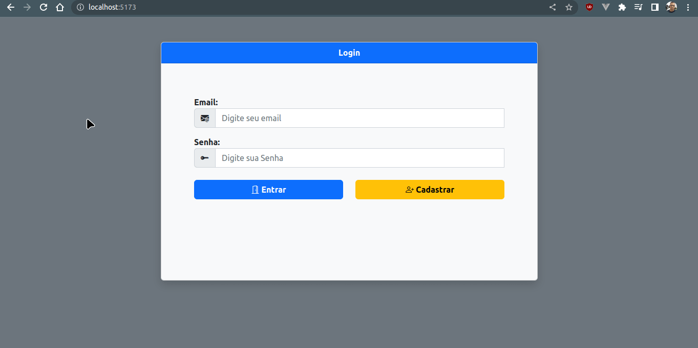
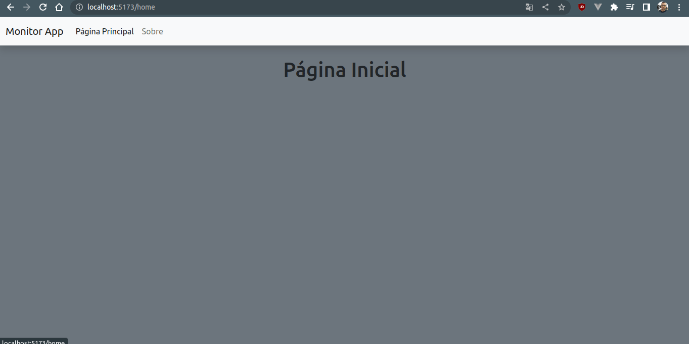

# dw-vite-project

Neste projeto foi utilizado o **Vite + Vanilla JS + Bootstrap 5 + Bootstrap Icons**, para criar uma estrutura de projeto simples e rápida para desenvolvimento de aplicações web.

O intuito deste projeto é que você possa utilizar o Vite para criar aplicações web com Vanilla JS, e que você possa utilizar o Bootstrap 5 e o Bootstrap Icons para estilizar a sua aplicação web.

Fique a vontade para utilizar esta estrutura como base para os seus projetos, ou editar a mesma para que ela atenda as suas necessidades.

## Instalação e Execução

Para instalar o projeto, basta seguir os passos abaixo:

* Clonar o repositório.

    ```git
    git clone https://github.com/mr-reinaldo/dw-vite-project.git 
    ```

* Entrar na pasta do projeto.

    ```bash
    cd dw-vite-project/frontend
    ```

* Instalar as dependências.

    ```bash
    npm install 
    ```

* Rodar o projeto.

    ```bash
    npm run dev 
    ```

## Alguns Screenshots do Projeto





## Links Úteis para o Desenvolvimento

* [Vite](https://vitejs.dev/)
* [Bootstrap](https://getbootstrap.com/)
* [Bootstrap Icons](https://icons.getbootstrap.com/)
* [Navigo](https://github.com/krasimir/navigo)

## Extensões VSCode

* [Inline HTML](https://marketplace.visualstudio.com/items?itemName=pushqrdx.inline-html)
* [Auto Close Tag](https://marketplace.visualstudio.com/items?itemName=formulahendry.auto-close-tag)
* [Auto Rename Tag](https://marketplace.visualstudio.com/items?itemName=formulahendry.auto-rename-tag)
* [IntelliSense for CSS class names in HTML](https://marketplace.visualstudio.com/items?itemName=Zignd.html-css-class-completion)
* [Class autocomplete for HTML](https://marketplace.visualstudio.com/items?itemName=AESSoft.aessoft-class-autocomplete)

## Explicando o uso das Extensões

* **Inline HTML**: Essa extensão permite que você escreva HTML dentro de arquivos JS, TS, JSX e TSX, e o VSCode irá reconhecer o HTML e aplicar a coloração de sintaxe correta para o HTML, ao retornar o HTML dentro de uma função coloca o comentário como no exemplo abaixo:

    ```javascript
    function App() {
        return /*html*/`
            <div>
                <h1>Olá Mundo!</h1>
            </div>
        `;
    }
    ```

* **Auto Close Tag**: Essa extensão permite que você escreva tags HTML e o VSCode irá fechar automaticamente a tag que você abriu, por exemplo, ao escrever a tag `<div>` o VSCode irá fechar a tag automaticamente, ficando assim:
  
  ```html
    <div></div>
    ```

* **Auto Rename Tag**: Essa extensão permite que você renomeie uma tag HTML e o VSCode irá renomear automaticamente a tag de fechamento da tag que você renomeou, por exemplo, ao renomear a tag `<div>` para `<section>` o VSCode irá renomear a tag de fechamento de `</div>` para `</section>`, ficando assim:

    ```html
    <section></div>

    <!--Ao mudar de div para section a tag de fechamento </> sera renomeada -->

    <section></section>
    ```

* **IntelliSense for CSS class names in HTML**: Essa extensão permite que você tenha o recurso de autocompletar as classes CSS dentro de tags HTML, por exemplo, ao escrever a tag `<div class="` o VSCode irá mostrar todas as classes CSS que você tem no seu projeto, e você pode navegar entre elas com as setas do teclado e pressionar enter para selecionar a classe que você deseja, ficando assim:

    ```html
    <div class="container">
        <h1>Olá Mundo!</h1>
    </div>
    ```

* **Class autocomplete for HTML**: Essa extensão permite que fecha as aspas duplas ao criar o atributo class dentro de tags HTML, por exemplo, ao escrever a tag `<div class="` o VSCode irá fechar as aspas duplas automaticamente, ficando assim:

    ```html
    <div class=""></div>
    ```

## Configurações do Vite

```javascript
export default {
    root: 'src',
    build: {
        outDir: '../dist',
        minify: true,
    },
}
```

* **root**: A propriedade `root` define a pasta onde o Vite irá buscar os arquivos do projeto.

* **build**: Define as configurações de build do projeto, a propriedade `outDir` define a pasta onde o Vite irá gerar os arquivos de build, a propriedade `minify` define se o Vite irá minificar os arquivos de build.
